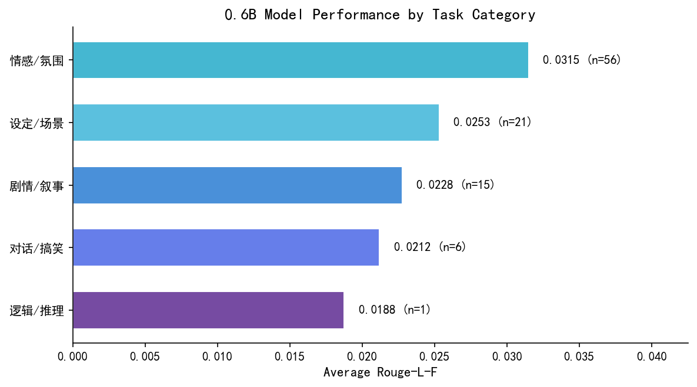
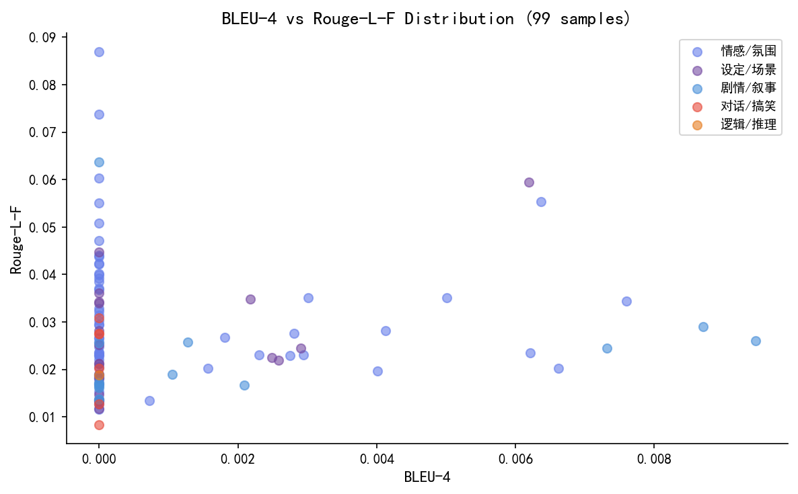

# 0.6B Light Novelist AI Desktop

> 仅 0.6B，但幻想自己是 14B · 氛围拉满，逻辑随缘


一个**超轻量**的桌面端轻小说 AI 写手，基于 [llama.cpp](https://github.com/ggerganov/llama.cpp) + Qwen3-0.6B-Instruct + LoRA 微调。**无需 Python 环境，解压即用。**

<!-- 截图占位，发布后可替换 -->
<!--  -->

## 特性

- **超轻量**：模型仅 0.6B 参数，完整包约 2GB，普通笔记本也能跑
- **GPU 加速**：内置 NVIDIA CUDA 12 运行时，RTX 50 系列实测 **~264 tok/s**
- **自定义 WebUI**：紫蓝渐变主题 + 顶部横幅，基于 llama-server 原版魔改
- **内置人设**：轻小说写手 system prompt，专注设定/世界观/场景描写
- **优雅 reasoning 框**：Qwen3 的 `<think>` 思考过程以可折叠灰色区块展示
- **零依赖**：无需安装 Python / PyTorch / CUDA Toolkit / Transformers

## 快速开始

### 方法一：Release 下载（推荐）

1. 进入右侧 [Releases](https://github.com/Artistkisa/0.6b-Light-novelist-AI-desktop/releases) 页面
2. 下载 `novelist-desktop-v1.0.zip`
3. 解压到任意文件夹
4. 双击 `start_llama.bat`
5. 浏览器自动打开 `http://127.0.0.1:8080`

### 方法二：源码运行（开发者）

```bash
pip install -r requirements.txt
python main.py
```

> 源码运行需要完整的 Python 环境（PyTorch + Transformers），体积 ~5GB，不推荐普通用户使用。

## 系统要求

| 项目 | 最低配置 | 推荐配置 |
|------|---------|---------|
| 操作系统 | Windows 10/11 | Windows 11 |
| GPU | 无（CPU 回退，20~40 tok/s） | NVIDIA RTX 20 系列及以上 |
| 显存 | — | 4GB+ |
| 内存 | 8GB | 16GB |
| 磁盘空间 | 2GB | 2GB+ |

> 无 NVIDIA 显卡也能运行，llama.cpp 会自动回退到 CPU。速度约 40 tok/s（9800X3D 参考值）。

## 模型信息

- **Base**: [Qwen3-0.6B-Instruct](https://huggingface.co/Qwen/Qwen3-0.6B)
- **微调**: LoRA，轻小说文本数据集（世界观、场景、对话）
- **格式**: GGUF F16
- **体积**: 1.14 GB

### 🍼 诞生记

这个模型不是在实验室里「计划」出来的，而是在阿里云 PAI 平台上「跑」出来的。

```
任务名称: distill_data_construction_20260213_t735
教师模型: Qwen3-14B
方法: EasyDistill 数据合成
资源: ecs.gn8v.6xlarge (24 vCPU, 128 GiB, GU8T × 1)
运行时长: 11 分 5 秒
状态: 已成功
```

2026 年 2 月 13 日 15:07，一个名为 `distill_data_construction_20260213_txxx` 的 PyTorchJob 在阿里云公共资源组启动。它用 Qwen3-14B 当老师，让 0.6B 的小模型「看」了大量轻小说文本——世界观、场景、对话、情绪片段。11 分钟后，数据合成完成，这个小不点拥有了它的第一份「写作经验」。

> 从 14B 到 0.6B，不是能力的压缩，是**氛围的传承**。

## 技术栈

- **Backend**: llama.cpp (llama-server b8986, CUDA 12.4)
- **Model**: T1.gguf (Qwen3-0.6B-Instruct + LoRA)
- **Frontend**: llama-server WebUI（魔改版：自定义 CSS + 默认配置覆盖）
- **训练**: PyTorch 2.11 + PEFT + Transformers 4.51.3

## 目录结构

```
0.6b-Light-novelist-AI-desktop/
├── T1.gguf                              # 模型文件
├── llama-b8986-bin-win-cuda-12.4-x64/   # llama.cpp 服务端
│   ├── llama-server.exe
│   ├── ggml-cuda.dll
│   └── ... (CUDA runtime DLLs)
├── webui/                               # 自定义 WebUI
│   ├── index.html                       # 魔改标题 + CSS + 横幅
│   ├── webui-config.json                # 默认配置覆盖
│   ├── bundle.js
│   └── bundle.css
├── start_llama.bat                      # 一键启动（推荐）
├── start_all.bat                        # llama-server + Gradio 双端
├── src/                                 # Gradio 前端源码
└── README.md
```

## 常见问题

**Q: 双击 start_llama.bat 后黑窗口闪了一下就关了？**
> 通常是 CUDA DLL 缺失或模型文件找不到。检查 `T1.gguf` 和 `llama-b8986-bin-win-cuda-12.4-x64/llama-server.exe` 是否在同级目录。

**Q: 输出为什么是英文？**
> 用中文提示词即可，模型本身支持中文。如果仍出英文，尝试在提示词前加 "请用中文"。

**Q: 模型写了两段就停了？**
> 0.6B 模型的物理上限，正常现象。调大 "Output Length" slider 到 1024-2048，但实际通常 300-500 tokens 就自停。

**Q: 只有 thinking 内容，没有正文？**
> 小模型容易陷入 reasoning 模式。WebUI 设置中已关闭 reasoning parsing，thinking 内容会作为普通文本显示。也可以尝试调高 temperature 或换更具体的提示词。

**Q: 怎么调整系统提示（System Prompt）？**
> 点击界面左下角 ⚙️ Settings → System Message，修改后新对话生效。

**Q: 支持 macOS / Linux 吗？**
> 当前 Release 仅提供 Windows 二进制。macOS/Linux 用户可从源码运行，需自行编译 llama-server 或安装对应平台的 llama.cpp 二进制。

## Gradio 双端（可选）

仓库同时保留了 Gradio UI 代码。运行 `start_all.bat` 可同时启动：
- llama-server @ `:8080`（原版 WebUI）
- Gradio @ `:7860`（定制 UI，含恶搞标题和 show_thinking 开关）

需要 Python 环境：`pip install -r requirements.txt`

## 文本生成展示

基于阿里 PAI 平台 99 条测试样本的实测结果（BLEU-4≈0，Rouge-L-F 最高 8.7%）。0.6B 模型的特点是**结构化输出强、逻辑链弱**。

### ✅ 擅长：情感描写 & 场景设定

**Prompt**：描述主角在绝望中找到希望的转折点。

> 在深夜的雨夜，主角蜷缩在阁楼的木箱前，手指紧握着泛黄的信封。箱子里的信纸被雨水浸湿，字迹却清晰可辨——那是母亲临终前写的最后信。当主角颤抖着打开信封，发现信纸上写着："我知道你最需要我了"。窗外的雨突然停了，月光洒进房间，照亮了母亲留下的照片。原来，母亲从未离开过这个房间，而主角终于明白，真正的希望来自家庭的温暖。

**评分**：Rouge-L-F = **0.0870**（全场最高）

---

**Prompt**：描述一个日常系动漫中的校园文化祭场景。

> 在一个日常系动漫的校园文化祭场景中，阳光透过教室的玻璃洒在操场上，粉笔灰在微风中轻轻飘散。教室里飘着学生们的书包和作业本，走廊的尽头挂着自制的灯笼，里面插着学生们亲手拼接的校徽。
>
> 文化祭开始前，全体学生围坐在操场的长椅上，用手机屏幕照亮彼此的笑脸。教室里传来老师宣布的口号声："让我们用最热烈的掌声，为校园文化祭献上最温暖的祝福！"
>
> 活动流程分为三个环节。第一环节是才艺展示……第二环节是"校园记忆分享"……第三环节是"校园文化大赏"……
>
> 在文化祭的高潮，当所有学生齐声唱响《校园文化祭》时，操场的樱花树下突然绽放出绚丽的烟花。礼花在天空中绚烂绽放，照亮了整个校园。

**评分**：Rouge-L-F = **0.0595**（设定类最佳）

> 💡 **特点**：能按「场景 → 流程 → 高潮 → 收尾」的结构化模板输出，氛围渲染到位。

---

### ❌ 不擅长：搞笑对话 & 逻辑推理

**Prompt**：写一段搞笑的日常小剧场对话。

> **爸爸**：（拿起菜刀）"今天数学课要考满分，你得好好复习啊！"
>
> **妈妈**：（端着锅铲）"哎呀，你这是要考满分吗？我刚买了新的教科书！"
>
> **孩子**：（突然跳起来）"我！我考完数学后要去超市买新书！"
>
> **妈妈**：（慌乱地跑过来）"你这是疯了！我们去厨房吃饭吧！"
>
> **孩子**：（突然哭）"我...我妈妈说我考了满分！"

**评分**：Rouge-L-F = **0.0083**（对话类最低）

> ⚠️ **问题**：对话逻辑混乱，笑点生硬，人物行为缺乏连贯性。「拿起菜刀」和「考满分」之间没有因果关系，属于典型的**逻辑链崩坏**。

---

### 📊 测试数据汇总



| 类别 | 样本数 | 平均 Rouge-L-F | 表现 |
|------|--------|---------------|------|
| 情感/氛围 | 56 | 0.0315 | ⭐⭐⭐ 最佳 |
| 设定/场景 | 21 | 0.0253 | ⭐⭐⭐ 结构化强 |
| 剧情/叙事 | 15 | 0.0228 | ⭐⭐☆ 中等 |
| 对话/搞笑 | 6 | 0.0212 | ⭐☆☆ 较弱 |
| 逻辑/推理 | 1 | 0.0188 | ⭐☆☆ 最弱 |



**结论**：0.6B 模型适合**氛围渲染、世界观设定、场景描写**，不适合**复杂逻辑、搞笑段子、严密推理**。

---

### 📝 文笔精选（抛开分数，纯看文字）

> 以下两段是 99 条样本中文笔最好的，未经过任何后期修改，原汁原味。

**Prompt**：描述一个能够听见植物声音的角色日常。

> 在这个被自然包围的世界里，林夏的日常就像一幅流动的画卷。清晨的薄雾还未散尽，她便用指尖轻触窗台，听见泥土深处传来细微的呼吸。晨露在她手中凝结成珠，折射出彩虹般的光芒，她会驻足凝视，仿佛在聆听大地的呼吸。
>
> 午后阳光透过树叶斑驳的光影，她总爱坐在藤椅上，用听觉的敏锐捕捉到蝴蝶振翅时的音调。有时是蒲公英飘落的沙沙声，有时是蒲草在风中舒展的节奏。她会用放大镜观察这些声音的规律，发现它们与季节更替的脉动有着微妙的关联。
>
> 夜晚的寂静最是迷人。她会坐在露台的长椅上，闭上眼睛聆听月光在草叶间流淌的声音。有时是风掠过枯枝的低语，有时是蒲公英种子在风中飘散的沙沙声。当月光洒在她发间时，那些声音会化作细碎的星光，落在她鬓角，成为她与自然对话的见证。
>
> 林夏的日常总带着某种诗意的节奏，她的耳朵像聆听自然的耳语，将植物的声音编织成生活的韵律。在这个世界里，她既是园丁，也是倾听者，用听觉的敏锐，与植物对话，感受生命的律动。

> 💡 **亮点**：通篇无对话，全靠画面堆叠。比喻密集但不油腻（"泥土的呼吸"、"月光流淌"、"细碎的星光"），时间线从清晨→午后→夜晚，节奏如散文诗。这是 0.6B 模型在**氛围渲染**上的上限。

---

**Prompt**：创作一个关于失忆少女寻找记忆的故事开端。

> 林婉站在废弃图书馆的玻璃幕墙前，指尖摩挲着那盏斑驳的台灯。暮色透过玻璃洒在她灰白的发梢上，映出她布满老年斑的面容。这间被遗忘的图书馆，总是在某个阴雨绵绵的午后，让那些被遗忘的时光重新苏醒。
>
> "你又在找记忆了。"她听见自己轻声说，声音里带着一丝颤抖。自从母亲在2008年车祸后，她就再没去图书馆了。直到那天，她发现书架上散落着泛黄的信纸，那些信纸上的字迹在阳光下泛着青白的光。
>
> 她轻轻合上书架，指尖触到那本泛黄的《记忆的迷宫》。书页间夹着的照片里，父亲站在图书馆前的场景，照片的右下角写着"2008年10月15日"。照片里的父亲穿着深蓝色的西装，手里握着一本旧书，而林婉的发梢垂落，像是一道未愈的伤痕。
>
> 她转身望向书架，月光在玻璃上投下斑驳的光影。那些被封存的记忆碎片，此刻正在她手中慢慢苏醒。

> ⚠️ **局限**：后半段模型陷入了自我推理循环（母亲冰冷、衣角散开等突兀转折），所以只截取前半段。但这四段画面描写——**暮色、灰白发梢、斑驳台灯、泛黄信纸、青白的字迹**——已经足够说明模型在**细节铺陈**上的功力。

## 已知限制

### 0.6B 模型的先天局限

这不是 bug，是**物理层面**的限制。0.6B（6 亿参数）是什么概念？作为对比：

| 模型 | 参数量 | 体积 | 能力定位 |
|------|--------|------|---------|
| **本模型** | 0.6B | ~1GB | **氛围写手** |
| Qwen3-8B | 8B | ~16GB | 通用对话 |
| GPT-4 | ~1.8T | 云端 | 全能推理 |

0.6B 的「脑容量」只有 GPT-4 的 **三千分之一**。它的神经网络层数浅、注意力头少，决定了它只能做**短程关联**，无法做**长程逻辑链**。

具体表现：

| 限制 | 原因 | 通俗解释 |
|------|------|---------|
| **输出 300-500 tokens 自停** | 注意力窗口饱和 | 就像人一口气只能写一段话，再写下去脑子就「断片」了，不知道怎么接 |
| **逻辑推理弱** | 层数浅，无法构建多步因果链 | 让它算「A→B→C→D」可以，但「A→B→C→D→E→F」中间必崩 |
| **搞笑/吐槽生硬** | 幽默依赖文化语境和反常识联想 | 0.6B 的「常识库」太小，get 不到笑点，只会硬套网络梗 |
| **容易陷入 thinking** | Qwen3 的 `<think>` 机制被过度触发 | 模型「想太多」却「写不出」，卡在自我分析里循环 |
| **多轮后「吃书」** | KV Cache 有限，早期上下文被挤出 | 聊到第 5 轮，它已经忘了第 1 轮说过什么，设定前后矛盾 |
| **BLEU/Rouge 分数低** | 评估指标要求输出和标准答案逐字接近 | 创意写作本就不该「和标准答案一样」，分数低不代表写得差 |

> 💡 **一句话总结**：0.6B 不是「小号的 GPT-4」，它是**专门的氛围渲染器**。用它写世界观、场景、情绪片段，别用它写论文、算数学、编笑话。

## ⚠️ 免责声明

**本产品本质上是「恶搞向」实验项目，请务必知悉：**

1. **模型能力极其有限**：0.6B 参数仅为主流大模型的 1/30 ~ 1/3000，输出内容**可能包含逻辑错误、事实错误、前后矛盾、无意义的重复**。请勿将其用于严肃写作、学术研究、商业决策或任何需要准确性的场景。

2. **「14B 效果」是自嘲，不是承诺**：项目标题中的「幻想自己是 14B」是一句玩笑话，指**氛围和语感上试图模仿大模型**，而非真的具备 14B 模型的推理和理解能力。

3. **输出内容需人工审核**：模型生成的所有文本都应被视为**草稿或灵感素材**，作者需要自行判断、修改、润色后方可使用。我们不保证生成内容的原创性、合规性或质量。

4. **训练数据来源**：LoRA 微调使用了公开可获取的轻小说文本作为训练数据，生成内容可能无意中与现有作品存在相似之处，使用者需自行承担版权相关风险。

5. **无担保**：本项目按「原样」提供，不作任何明示或暗示的担保，包括但不限于对适销性、特定用途适用性的担保。

> 🎭 **说人话**：这就是一个用来玩的玩具，写得出氛围就赚了，写崩了很正常。别拿它去写毕业论文、别拿它去骗甲方、别拿它的输出当真理。玩得开心。

### 使用建议

- **单次任务**：一个 prompt 只要求它做一件事（写场景 / 写设定 / 写对话），不要堆叠多个要求
- **及时重置**：每 3-5 轮对话新建一次 chat，避免上下文污染
- **温度调节**：写设定用 0.6-0.8（稳定），写灵感用 1.0-1.2（跳脱）
- **接受「半成品」**：它给出的经常是**素材片段**，需要你自己拼接成完整章节

## 版本历史

- **v1.0.0** (2026-04-30)
  - 初始发布
  - llama.cpp + Qwen3-0.6B + LoRA
  - 自定义 WebUI（紫蓝渐变主题）
  - GPU 加速支持

## 致谢

- [llama.cpp](https://github.com/ggerganov/llama.cpp) by [ggerganov](https://github.com/ggerganov)
- [Qwen3](https://github.com/QwenLM/Qwen3) by Alibaba Cloud
- 轻小说训练数据来源于各类公开日文轻小说文本

## License

本项目代码采用 [MIT License](LICENSE)。

模型权重遵循 [Qwen3 License](https://huggingface.co/Qwen/Qwen3-0.6B/blob/main/LICENSE)。
